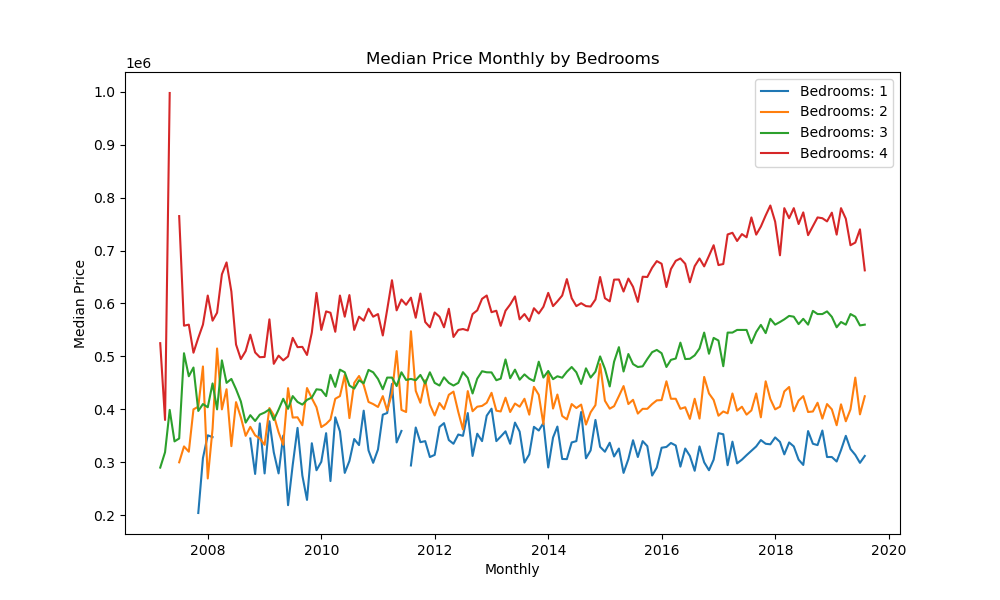
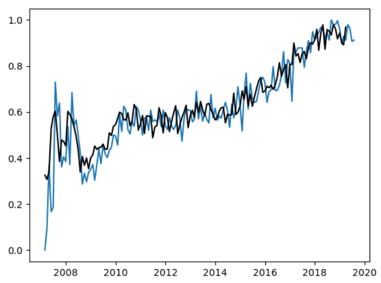
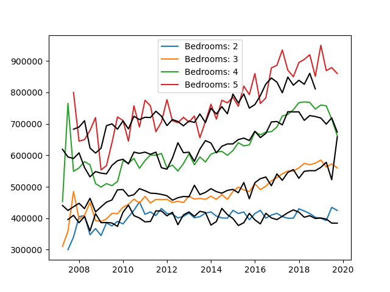
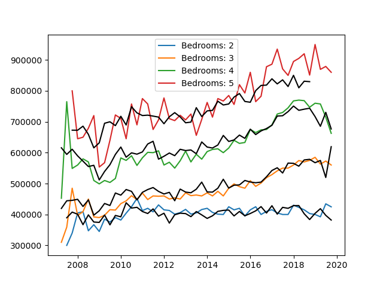

# Pytorch-cnn-lstm-forecast
基于pytorch搭建多特征CNN-LSTM时间序列预测，运行main.py即可，若要保存模型需手动添加相应代码……

# Datasets
[Kaggle上的房价预测](https://www.kaggle.com/datasets/htagholdings/property-sales/data)

# Attention
在模型上添加了attention机制，具体拟合效果可见图

# 原数据按照月度聚合

# 原数据按照季度聚合

# 单分类上的拟合（在bedrooms）

# 多分类上的拟合（未加入attention前）10w次iter

# 多分类上的拟合（加入attention后）10w次iter
